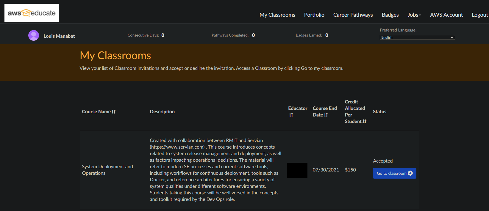
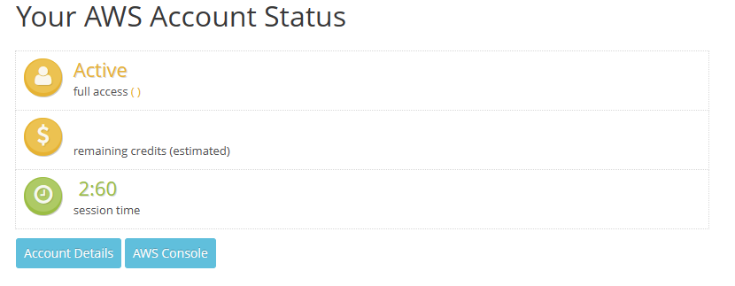
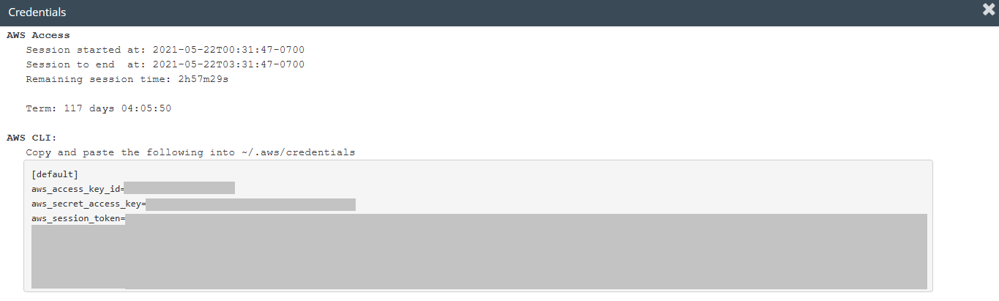
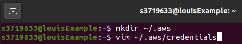
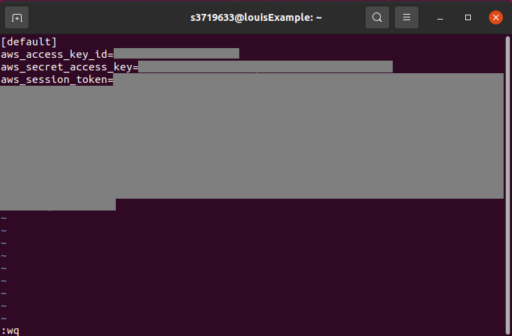

# Student: Louis Manabat (ID: s3719633)

## Contents Page:
- [Analysis and Solution](#Analysis-and-Solution)
    - [Analysis of the problem](#Analysis-of-the-problem)
    - [Explain and justify the solution](#Explain-and-justify-the-solution)
- [How to deploy the solutiion](#How-to-deploy-the-solutiion)
    - [Pre-requisites](#Pre-requisites)
        - [Manual installations](#Manual-installation)
        - [Semi-automatic installation](#Semi-automatic-installation)
    - [Setting up AWS Credentials](#Setting-up-AWS-Credentials)
    - [Running commands](#Running-commands)


# Analysis and Solution
## Analysis of the problem
The process of creating the artifact has now been containerised into a Docker container. This simplifies part of the deployment of the solution. The next task is to get the solution running through Kubernetes on a CD pipeline to make the deployment of the solution easier.

## Explain and justify the solution


# How to deploy the solutiion


## Pre-requisites


## Manual installation
##### Please note that each line is a new command
### Updating system 
    sudo apt update -y
    sudo apt upgrade -y
    sudo apt install curl make wget vim -y

#### Installing Terraform
    cd /tmp/
    wget https://releases.hashicorp.com/terraform/0.15.4/terraform_0.15.4_linux_amd64.zip
    unzip terraform_0.15.4_linux_amd64.zip
    sudo mv terraform user/local/bin

## Semi-automatic installation
##### Please note that each line is a new command
### Please run this command before starting the rest of the process
    sudo apt update -y
    sudo apt upgrade -y
    sudo apt install make -y

#### After successfully running that command, run the following commands (Each line is a new command)
    make install-deps
    make install-tf


## Setting up AWS Credentials
##### Please note we will being using AWS Educate for this example

First login into AWS Educate and press the **My Classrooms** tab at the top. Find the course you are currently in and press the blue **Go to classroom** button on the right. Press **Continue** on the prompt that appears


Upon entering the next page, press the **Account Details** button and you will be greeted with a bunch of credentials. Copy the entire set of text in the gray box as we will be using this for later. 
### Please note that these credentials should only be used by you and you only! Do not share this with anyone else
<br>


<br>

After doing this, open up a new tab in your terminal and run the command `mkdir ~/.aws` then run `vim ~/.aws/credentials` then press **INS** to activate insert mode then **Shift + INS** to paste the credentials. Follow this up with pressing **CTRL + C** then type in `:wq` to save and exit vim.
<br>



## Running commands


# Simple Todo App with MongoDB, Express.js and Node.js
The ToDo app uses the following technologies and javascript libraries:
* MongoDB
* Express.js
* Node.js
* express-handlebars
* method-override
* connect-flash
* express-session
* mongoose
* bcryptjs
* passport
* docker & docker-compose

## What are the features?
You can register with your email address, and you can create ToDo items. You can list ToDos, edit and delete them. 

# How to use
First install the depdencies by running the following from the root directory:
```
npm install --prefix src/
```

To run this application locally you need to have an insatnce of MongoDB running. A docker-compose file has been provided in the root director that will run an insatnce of MongoDB in docker. TO start the MongoDB from the root direction run the following command:

```
docker-compose up -d
```

Then to start the application issue the following command from the root directory:
```
npm run start --prefix src/
```

The application can then be accessed through the browser of your choise on the following:

```
localhost:5000
```
## Container
A Dockerfile has been provided for the application if you wish to run it in docker. To build the image, issue the following commands:

```
cd src/
docker build . -t todoapp:latest
```

## Terraform

### Bootstrap
A set of bootstrap templates have been provided that will provision a DynamoDB Table, S3 Bucket & Option Group for DocumentDB & ECR in AWS. To set these up, ensure your AWS Programmatic credentials are set in your console and execute the following command from the root directory

```
make bootstrap
```

### To instantiate and destroy your TF Infra:

To instantiate your infra in AWS, ensure your AWS Programattic credentials are set and execute the following command from the root infra directory:

```
make up -e ENV=<environment_name>
```

Where environment_name is the name of the environment that you wish to manage.

To destroy the infra already deployed in AWS, ensure your AWS Programattic credentials are set and execute the following command from the root directory:

```
make down -e ENV=<environment_name>
```

## Testing

Basic testing has been included as part of this application. This includes unit testing (Models Only), Integration Testing & E2E Testing.

### Linting:
Basic Linting is performed across the code base. To run linting, execute the following commands from the root directory:

```
npm run test-lint --prefix src/
```

### Unit Testing
Unit Tetsing is performed on the models for each object stored in MongoDB, they will vdaliate the model and ensure that required data is entered. To execute unit testing execute the following commands from the root directory:

```
npm run test-unit --prefix src/
```

### Integration Testing
Integration testing is included to ensure the applicaiton can talk to the MongoDB Backend and create a user, redirect to the correct page, login as a user and register a new task. 

Note: MongoDB needs to be running locally for testing to work (This can be done by spinning up the mongodb docker container).

To perform integration testing execute the following commands from the root directory:

```
npm run test-integration --prefix src/
```


###### This project is licensed under the MIT Open Source License
