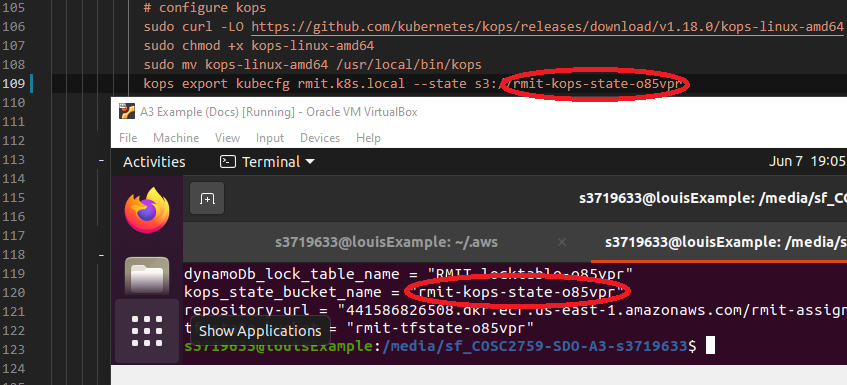

# Student: Louis Manabat (ID: s3719633)

## Contents Page:
- [Analysis and Solution](#Analysis-and-Solution)
    - [Analysis of the problem](#Analysis-of-the-problem)
    - [Explain and justify the solution](#Explain-and-justify-the-solution)
- [How to deploy the solutiion](#How-to-deploy-the-solutiion)
    - [Pre-requisites](#Pre-requisites)
        - [Manual installations](#Manual-installation)
        - [Semi-automatic installation](#Semi-automatic-installation)
    - [Setting up AWS Credentials](#Setting-up-AWS-Credentials)
    - [Pre-setup](#Pre-setup)
    - [Running commands](#Running-commands)


# Analysis and Solution
## Analysis of the problem
The process of creating the artifact has now been containerised into a Docker container. This simplifies part of the deployment of the solution. The next task is to get the solution running through Kubernetes on a CD pipeline to make the deployment of the solution easier.

## Explain and justify the solution
The solution uses several tools to deploy the solution. The process will essentially be automated, but to get it running, several Makefile commands need to be run to fully deploy the solution.

Tools:
GitHub: This is where the repository for the solution and the automation code will be stored on. In a further implementation of automating the process, CircleCI will be linked to GitHub to do CI/CD (Continuous Integration & Continuous Deployment)

Terraform: Terraform is the tool that automates the creation and updating of AWS services to help ease the process, and removes the need of having to create the services using manual labour. With this, it will lower the chances of using too many resources, meaning the company will save money, which then also means the company will gain a higher profit, which increases the satisfaction of the client. 

AWS: This is the service where the client wants to deploy the solution onto. Services such as an EC2 virtual machine instance, VPCs, S3 buckets and DynamoDB will be used to help run the Todo App solution when it is deployed.

CircleCI: CircleCI was used to automate the packing of the artefact, from doing linting and vulnerability checks to making a packed solution. It will also be used to fully automate the deployment process.

Docker: Docker will be used to containerise the application. It will pack the solution into an image. Once the the image has been created, it just needs to be deployed for it to be running.

Kubernetes: Kubernetes is a service that deploys, scales and manages the application. It will be using the container that Docker creates to deploy the application. 

Helm: Helm will be used to manage the Kubernetes cluster. This will manage things like the porting, databsing and the deploying of the application.

# How to deploy the solutiion

Please note before getting started you must have an AWS account to get started. The way this tutorial will do it will differ from how you may do it, so please keep that in mind. We will be running this in VirtualBox using an Ubuntu 20.04 image.

## Pre-requisites


## Manual installation
##### Please note that each line is a new command
### Updating system 
    sudo apt update -y
    sudo apt upgrade -y
    sudo apt install curl make wget vim -y

#### Installing Terraform
    cd /tmp/
    wget https://releases.hashicorp.com/terraform/0.15.4/terraform_0.15.4_linux_amd64.zip
    unzip terraform_0.15.4_linux_amd64.zip
    sudo mv terraform user/local/bin

## Semi-automatic installation
##### Please note that each line is a new command
### Please run this command before starting the rest of the process
    sudo apt update -y
    sudo apt upgrade -y
    sudo apt install make -y

#### After successfully running that command, run the following commands (Each line is a new command)
    make install-deps
    make install-tf


## Setting up AWS Credentials
##### Please note we will being using AWS Educate for this example

First login into AWS Educate and press the **My Classrooms** tab at the top. Find the course you are currently in and press the blue **Go to classroom** button on the right. Press **Continue** on the prompt that appears


Upon entering the next page, press the **Account Details** button and you will be greeted with a bunch of credentials. Copy the entire set of text in the gray box as we will be using this for later. 
### Please note that these credentials should only be used by you and you only! Do not share this with anyone else
<br>


<br>

After doing this, open up a new tab in your terminal and run the command `mkdir ~/.aws` then run `vim ~/.aws/credentials` then press **INS** to activate insert mode then **Shift + INS** to paste the credentials. Follow this up with pressing **CTRL + C** then type in `:wq` to save and exit vim.
<br>


## Pre-setup

### Bootstrap
The following command will create some files to make a remote backend. Run the command **once only** and them copy the two values into the respective variables in *main.tf* in the infra directory.

    make bootstrap
You should first see these variables after completing `make bootstrap`.
<br>

<br>

Following that, you will copy the **dynamoDb_lock_table_name** and the **tf_state_bucket** and paste them into the *makefile*. You should be only changing the **bucket** (using the **tf_state_bucket** variable) and **dynamodb_table** (using the **dynamoDb_lock_table_name**) variables under the init command.
<br>

<br>

After that, use the **kops_state_bucket_name** and add that to *config.yml*. Around line 34, there is a line that has;
    kops export kubecfg rmit.k8s.local --state s3://rmit-kops-state-
Replace the **rmit-kops-state-** with the variable that **kops_state_bucket_name** provided from the `make bootstrap` command.
<br>

<br>

Finally, use the **repository-url** output and add that to the **ECR** and **reponame** variables in *config.yml* (Somewhere around line 130 under the package jobs). The link before the forward slash ('/'), that goes into the **ECR** variable, whereas the name after the forward slash ('/'), goes into the **reponame** variable.
<br>

<br>

Once you have compeleted that, push your changes to GitHub.

### Setting up CircleCi
We will now set up CircleCi to being deployment. Open up the link https://circleci.com/ and press the **Go to App** icon on the top right. If you haven't linked your GitHub account to CircleCi, please do it now. After that, go to the Projects page (button on the left side), and find the repository. Press the **Set up Project** button and it'll coninue to the next screen. Press the **Use Existing Config** button, then **Start Building**.
<br>

<br>

<br>

<br>

## Running commands


# Simple Todo App with MongoDB, Express.js and Node.js
The ToDo app uses the following technologies and javascript libraries:
* MongoDB
* Express.js
* Node.js
* express-handlebars
* method-override
* connect-flash
* express-session
* mongoose
* bcryptjs
* passport
* docker & docker-compose

## What are the features?
You can register with your email address, and you can create ToDo items. You can list ToDos, edit and delete them. 

# How to use
First install the depdencies by running the following from the root directory:
```
npm install --prefix src/
```

To run this application locally you need to have an insatnce of MongoDB running. A docker-compose file has been provided in the root director that will run an insatnce of MongoDB in docker. TO start the MongoDB from the root direction run the following command:

```
docker-compose up -d
```

Then to start the application issue the following command from the root directory:
```
npm run start --prefix src/
```

The application can then be accessed through the browser of your choise on the following:

```
localhost:5000
```
## Container
A Dockerfile has been provided for the application if you wish to run it in docker. To build the image, issue the following commands:

```
cd src/
docker build . -t todoapp:latest
```

## Terraform

### Bootstrap
A set of bootstrap templates have been provided that will provision a DynamoDB Table, S3 Bucket & Option Group for DocumentDB & ECR in AWS. To set these up, ensure your AWS Programmatic credentials are set in your console and execute the following command from the root directory

```
make bootstrap
```

### To instantiate and destroy your TF Infra:

To instantiate your infra in AWS, ensure your AWS Programattic credentials are set and execute the following command from the root infra directory:

```
make up -e ENV=<environment_name>
```

Where environment_name is the name of the environment that you wish to manage.

To destroy the infra already deployed in AWS, ensure your AWS Programattic credentials are set and execute the following command from the root directory:

```
make down -e ENV=<environment_name>
```

## Testing

Basic testing has been included as part of this application. This includes unit testing (Models Only), Integration Testing & E2E Testing.

### Linting:
Basic Linting is performed across the code base. To run linting, execute the following commands from the root directory:

```
npm run test-lint --prefix src/
```

### Unit Testing
Unit Tetsing is performed on the models for each object stored in MongoDB, they will vdaliate the model and ensure that required data is entered. To execute unit testing execute the following commands from the root directory:

```
npm run test-unit --prefix src/
```

### Integration Testing
Integration testing is included to ensure the applicaiton can talk to the MongoDB Backend and create a user, redirect to the correct page, login as a user and register a new task. 

Note: MongoDB needs to be running locally for testing to work (This can be done by spinning up the mongodb docker container).

To perform integration testing execute the following commands from the root directory:

```
npm run test-integration --prefix src/
```


###### This project is licensed under the MIT Open Source License
